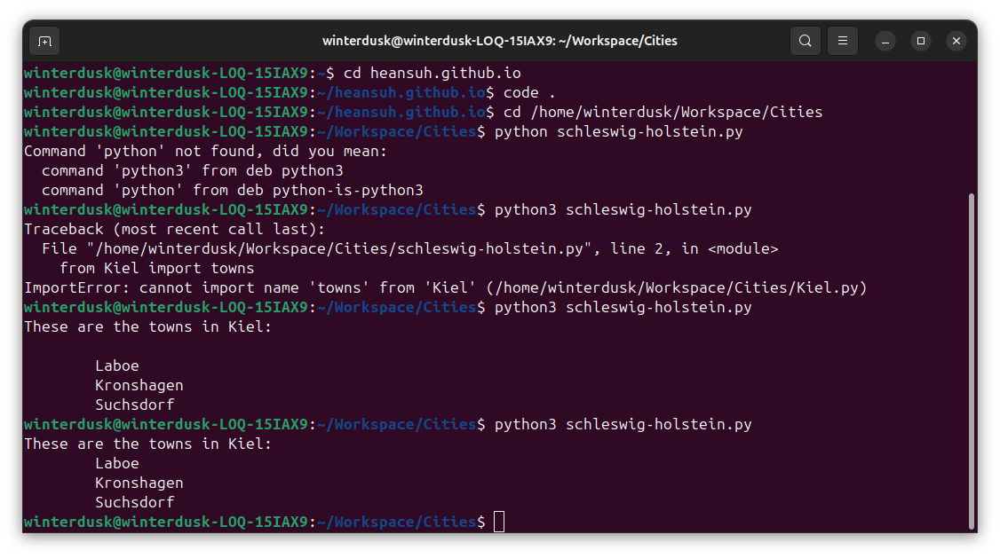

## Introduction

In this post, I will have a look at how to create a local Python package and use it.

## Purpose

In usual cases, we use Python packages from [PyPi](https://packaging.python.org/en/latest/tutorials/packaging-projects/), with a `pip install` command that is widely used or we are familiar with.

What I would like to achieve here is to **not upload** on PyPi and only use `pip install` as a local package.

I decided to learn about it as I realised that my company deals with local packages, and I felt like I need to know the structure of it.

This post references [Create and Access a Python Package](https://www.geeksforgeeks.org/create-access-python-package/) from GeeksforGeeks.

## Steps

The main 3 steps are as follow:

1.  **Create directory:** this is the same as the package name.
    
2.  Put **classes** and **required functions** in this directory.
    
3.  Create an `__init__.py` file inside the directory, to let Python know that the directory is a package.\*
    

_Note:_ `__init__.py` _file can be placed after creating the directory_

### 1. Create directory

*   We are creating `Cities` directory for instance here.
    
*   Here I will add, let's say the 3 cities in Schleswig-Holstein: `Kiel`, `Flensburg`, `Husum`. These cities will be the **modules.**

### 2. Classes and functions in package

*   Each city can be created as files with .py endings (i.e. `Kiel.py`), creating contents with classes, using constructor.
    
```python
class Kiel:
    def __init__(self):
        self.towns = ['Laboe', 'Kronshagen', 'Suchsdorf']

    def printTowns(self):
        print('These are the towns in Kiel:')
        for town in self.towns:
            print('\t%s ' % town)
```
    
*   Let's try with this with the capital city `Kiel`, in a separate script in the same directory, called `schleswig-holstein.py`.  

```python
# Import classes from your brand new package
from Kiel import Kiel

# Create an object of Kiel class & call its method
ModTowns = Kiel()
ModTowns.printTowns()
```

### 3. `__init__.py` file in the directory

*   Self-explanatory. Let's place this file in the directory, and run the code.

At the end, you'll be able to see something like this (please ignore the outputs before):



There were errors initially with naming, such as `from Kiel import Towns`

I also realised that I didn't add the `__init__.py` and it works fine.

Although this is correct, the reason why it's not adopted is because you wouldn't be able to differentiate directories that are for packages and normal Python scripts - more information can be found [here](https://dev.arie.bovenberg.net/blog/still-use-init-py/).